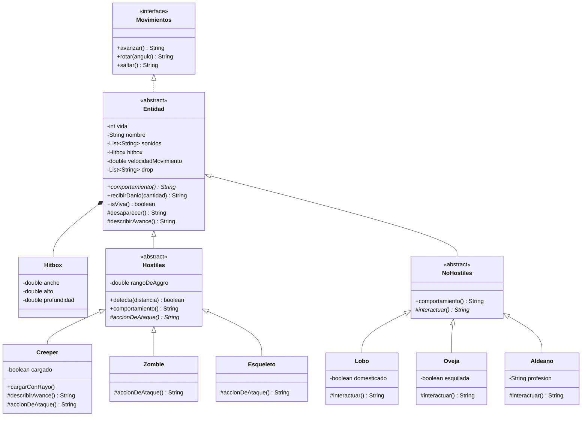

Amir, AmirDujak, CYT646 F
./mvnw spring-boot:run

# Taller Git 2026 — Minecraft (opción A)

Servicio HTTP (Spring Boot, API REST) que expone el modelado de entidades de Minecraft,
con herencia, sobreescritura y ocultamiento de la información.

## Endpoints

| Método | Ruta | Descripción |
|---|---|---|
| GET | `/` | Mensaje de bienvenida |
| GET | `/entidad/{tipo}` | Crea una entidad (`creeper`, `zombie`, `esqueleto`, `lobo`, `oveja`, `aldeano`) y muestra su comportamiento |
| GET | `/entidad/aldeano?profesion=Herrero` | Parámetro de consulta usado por el constructor de `Aldeano` |
| GET | `/entidad/zombie?danio=25` | Además le aplica daño a la entidad |
| GET | `/entidades` | Todas las entidades, cada una con su propio comportamiento |

## Diagrama de clases

## Decisiones de diseño

- **Método abstracto en la clase base:** `Entidad.comportamiento()`. Las dos hijas `Hostiles` y `NoHostiles`
  lo implementan de forma independiente (atacar o interactuar), y cada mob concreto redefine solo su parte
  (`accionDeAtaque()` o `interactuar()`).
- **Trato uniforme:** el controller y `Main` solo usan el tipo `Entidad` para moverse, recibir daño y
  desaparecer, sin preguntar el tipo concreto.
- **Ocultamiento:** todos los campos son `private` y no hay setters. La vida solo cambia con `recibirDanio()`
  o `desaparecer()`. Los constructores validan los datos (vida > 0, daño ≥ 0, hitbox positiva, profesión
  no vacía) y una entidad muerta no puede moverse ni recibir daño.
- **Sin campos `protected`:** donde una hija necesita algo de la base se usa un método `protected`.
  `desaparecer()` existe porque el `Creeper` muere al explotar sin recibir daño, y `describirAvance()`
  porque el `Creeper` avanza de forma sigilosa.
